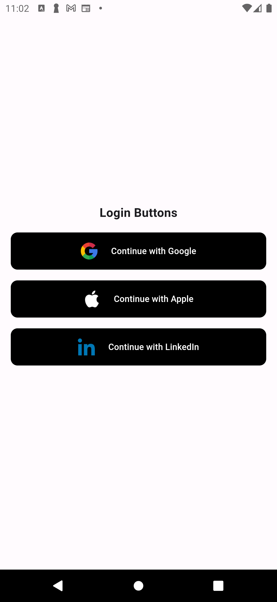

# login_button_suite

A Flutter package providing customizable social login buttons for Google, Apple, and LinkedIn (and may more to come).


### Features.
- Pre-styled buttons for Google, Apple, and LinkedIn
- Customizable text and styles
- Loading state support
- Easy to implement


<image src="assets/images/white_btns.png">


## Important
This package doesn't include logo assets. You must provide your own logo images and declare them in your **pubspec.yaml**:

```yaml
flutter:
  assets:
    - assets/images/google.png
    - assets/images/apple_white.png
    - assets/images/apple_black.png
    - assets/images/linkedin.png
```
I recommend you to get the icons from [Flaticon][https://www.flaticon.com/]

## Installation

```yaml
dependencies:
  login_buttons: ^1.0.0
```
Don't forget to add your logo assets:

```dart
// Google Login Button
LoginButtons.google(
style: LoginButtonStyle.black,
onPressed: () {
    setState(() => isLoading = true);
    Future.delayed(const Duration(seconds: 2), () {
        setState(() => isLoading = false);
    });
},
isLoading: isLoading,
),

// Apple Login Button
LoginButtons.apple(
style: LoginButtonStyle.black,
onPressed: () => handleAppleLogin()),

// LinkedIn Login Button
LoginButtons.linkedin(
style: LoginButtonStyle.black,
    onPressed: () => handleLinkedInLogin()),
```

## Customization

Each button accepts these parameters:

* **onPressed**: Callback function when button is pressed
* **text**: Custom button text
* **style**: LoginButtonStyle.white or LoginButtonStyle.black
* **isLoading**: Show loading indicator instead of icon

### License
This project is licensed under the MIT License - see the LICENSE file for details.

## Say Hello
- [LinkedIn][https://www.linkedin.com/in/benmukanirwa/]
- [X][https://x.com/benmukanirwa]
- [IG][https://www.instagram.com/__ben.mk/]


